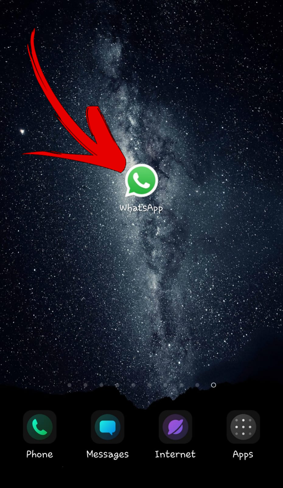
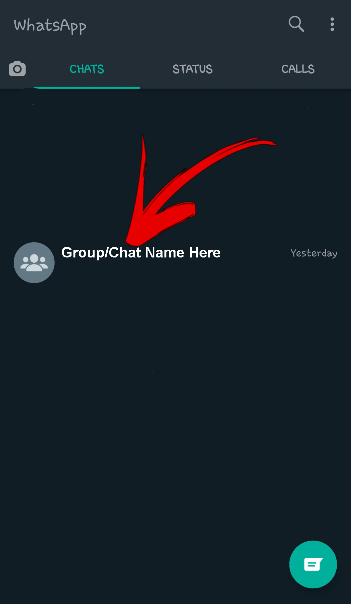
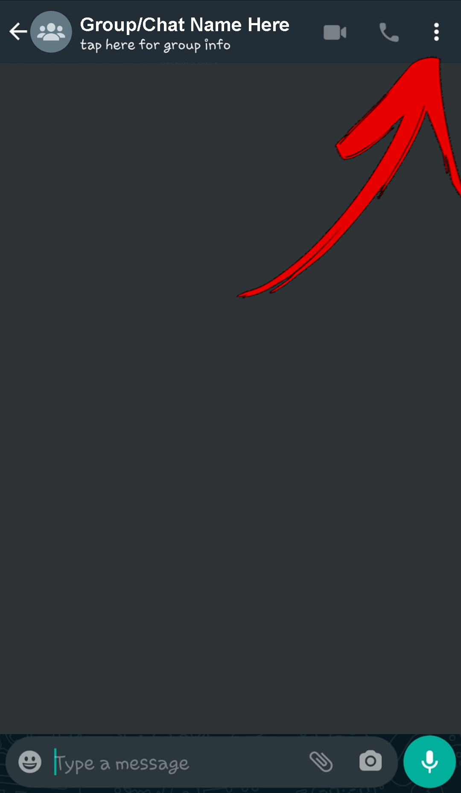
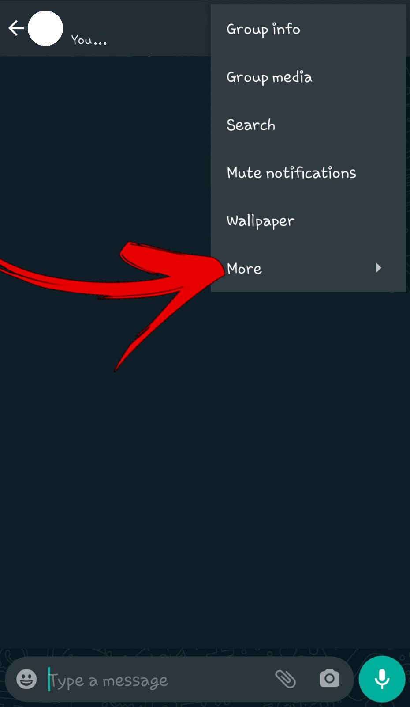
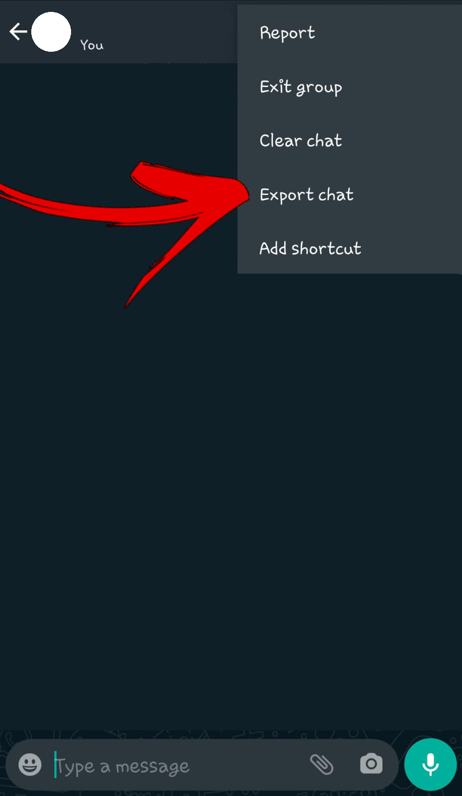

# JWhatsApp
Hello! Let's get straight to it. You wanna know stats about your WhatsApp chats. Simple enough.

### How do you do that?
Easy! Follow these steps and you should be all good:
1. Clone this repository onto your computer.
2. Import the chats.
3. Tweak the settings.
4. Execute the program.

#### Stage 1
Cloning a repository is something you should know how to do.
Click the green "Code" button above, "Open with GitHub Desktop" if you have it,
or any other method you wish. Just make sure all the ```.class``` files are on your machine.
**Open the folder with your files, and add a subfolder called 'raw' and another called 'saved'.**

#### Stage 2
Importing the chats from WhatsApp onto your computer.

- First, get your phone. Open WhatsApp.
- Second, open WhatsApp Web [https://web.whatsapp.com].
- Now, here are a few images to guide you. This is in Android, but I imagine a similar process could be done on iOS.
1. Open WhatsApp on your phone.

2. Select the chat you wish to analyze:

3. Click the three dots in the corner:

4. Click "More >"

5. Select "Export chat"

6. And "WITHOUT MEDIA"

7. Then WhatsApp will load the chat, and finally (maybe after a few minutes) ask you to share it. Share via WhatsApp to some chat (not necessarily the same one):

8. Finally, you should see a ```.txt``` file in your chat.

9. Now, move to your computer, and download the chat. Make sure to save it in ```project_folder / raw /```!

* You might also want to rename it, to be without emojis or difficult characters. The first part of "WhatsApp Chat with " do not touch.

##### You may repeat this process with as many chats as you wish.

#### Stage 3
Tweaking the settings:
Open (using whichever text editor you wish) the file ```settings.txt```.
It should look something like this:
```
render_final: 1
optimize: 0
generate_names: ["*"]
render_names: []
colored: 1
```
```render_final``` - boolean (true/false/1/0). Determines whether to render the final view, which relates all the chats.

```optimize``` - Finding common words and letters is computationally heavy, so if you aren't interested in those, I'd recommend setting this to true or 1, to increase performance.

```generate_names``` - here you should insert an array, bounded by ```[``` and ```]```, separated by commas (```,```), with each element being a string with the chats' names you with to generate. On your first run, this should be ```["*"]```, meaning all chats.

```render_names``` - same array format as generate_names, and those you choose here will be rendered using graphs.

```colored``` - set to true if your terminal supports *ANSI coloring* (for example, PyCharm or IntelliJ), and set to false if it doesn't (for example, Windows CMD).

#### Stage 4
Execute ```Main.class``` with either:
- IntelliJ Run button.
- CMD commands ```> cd "[FOLDER PATH]"``` ```> java Main```
- Any other way you think will work.

Now you have the data generated, and you can render the graphs using 'matplotlib' in the python version.
Here are the CMD commands (you can also run in PyCharm):

```cd "[FOLDER PATH]"```

```python3 main.py```
